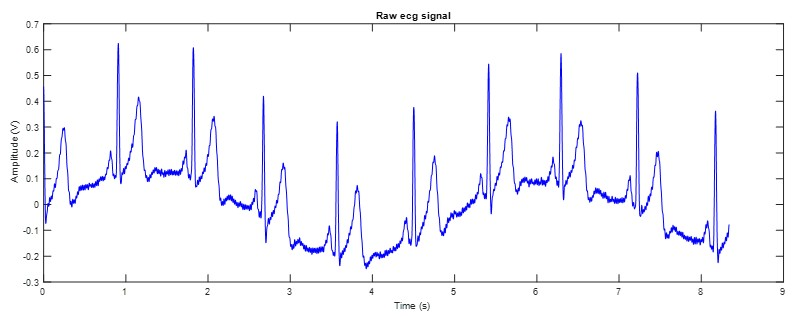

# ECG Signal Processing and Heart Rate Estimation

This repository contains the implementation of my **final project** for the *Biomedical Signal Processing (BSP)* course.  
The project focuses on **denoising ECG signals** and **estimating heart rate** using MATLAB.

## 📈 Raw ECG Signal
Below is the raw ECG signal before filtering:

The main tasks include:
- Plotting the raw ECG signal
- Performing FFT analysis
- Removing low-frequency baseline wander (< 0.5 Hz)
- Suppressing powerline interference (50 Hz) with a notch filter
- Increasing the signal-to-noise ratio (SNR) using low-pass filtering
- Estimating heart rate via autocorrelation analysis
